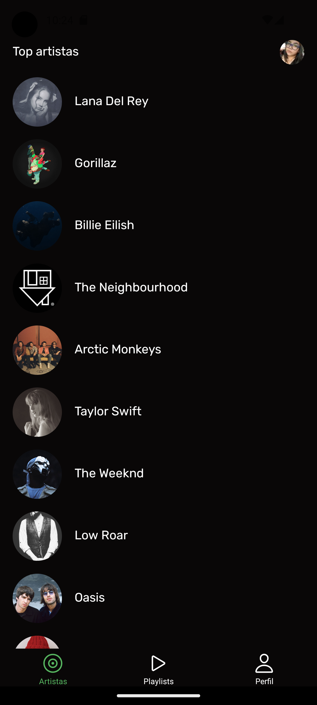

<h2 align="center">Simulador do Spotify</h2>
<p align="center">
  Um aplicativo simulador do Spotify para sua comodidade!
  <br />
  <a href="https://github.com/cassiorodp/react_native_spotify" target="_blank">Código Fonte</a>
  ·
    <a href="https://expo.dev/accounts/cassiorodp/projects/react-spotify/builds/a9a8bae9-5572-4817-adda-6d570189cec2" target="_blank">App</a>
  ·
  <a href="https://github.com/cassiorodp/react_native_spotify/issues" target="_blank">Reportar Bug</a>
</p>

---

<p align="center">
  <a href="https://expo.dev/accounts/cassiorodp/projects/react-spotify/builds/a9a8bae9-5572-4817-adda-6d570189cec2" target="_blank">
 
  </a>
</p>

---

<details open="open">
  <summary><h2">Sumário</h2></summary>
  <ol>
    <li>
      <a href="#about">Sobre</a>
      <ul>
        <li><a href="#objectives">Objetivos</a></li>
      </ul>
    </li>
    <li>
      <span>Instruções</span>
      <ul>
        <li><a href="#requirements">Requisitos</a></li>
        <li><a href="#running-the-app">Executando o Aplicativo</a></li>
      </ul>
    </li>
    <li><a href="#architecture-and-techs">Arquitetura e Tecnologias</a></li>
    <li><a href="#contribution">Contribuição</a></li>
    <li><a href="#contacts">Contatos</a></li>
  </ol>
</details>

<h2 id="about">⚡ Sobre</h2> 
<p align="center">
  Este aplicativo é um simulador do Spotify desenvolvido para fornecer fácil acesso a determinadas funcionalidades da API do Spotify.
</p>

<h3 id="objectives">🎯 Objetivos</h3>

- Listar os artistas mais ouvidos
- Listar álbuns desses artistas
- Listar playlists do usuário
- Criar uma nova playlist
- Exibir os dados do usuário

<h3>Instruções</h3>

<h3 id="requirements">Requisitos</h3>

Abaixo estão os requisitos (obrigatórios e bônus).

```markdown
# Requisitos

## Requisitos Obrigatórios

- [x] Autenticação via Spotify
- [x] Listar artistas
- [x] Listar álbuns de um artista
- [x] Utilizar paginação (scroll infinito ou não)
- [x] Funcionamento offline (manter dados em storage local)
- [x] Testes unitários
- [x] Seguimento de commits

## Bônus

- [ ] Testes instrumentados
- [ ] Integração com Firebase (Crashlytics)
- [ ] CI/CD (pipelines e deploy)
- [ ] Responsividade (celular e tablet)
```

<h2 id="running-the-app">🚀 Executando o Aplicativo</h2>
Para executar o aplicativo, siga estas instruções.

<h3 id="prerequisites">Baixando a Aplicação</h3>

Se você deseja apenas baixar a build da aplicação, você pode acessar o seguinte link para baixar o arquivo de instalação:

[Download da Aplicação](https://expo.dev/accounts/cassiorodp/projects/react-spotify/builds/a9a8bae9-5572-4817-adda-6d570189cec2)

Após baixar o arquivo de instalação, instale o aplicativo em um dispositivo Android.

<h3 id="prerequisites">Pré-requisitos (Build desenvolvimento)</h3>

Certifique-se de ter as seguintes ferramentas instaladas: NPM & Git.
Além disso, se você planeja contribuir posteriormente, é bom ter um editor de código como VSCode.

baixe e instale o aplicativo [Expo Go](https://expo.dev/go) no seu dispositivo Android ou emulador e baixe a [Build de Desenvolvimento](https://expo.dev/accounts/cassiorodp/projects/react-spotify/builds/b28f118f-719f-4936-8dff-7d76b22fd749)

<h3 id="installation">Instalação</h3>

1. **Configuração das Credencias do Spotify**

- Crie um aplicativo no [Painel de Desenvolvedores do Spotify](https://developer.spotify.com/dashboard)
- Adicione o valor `reactspotify://` no campo Redirect URIs na página de configurações do aplicativo
- Selecione o valor Web API no campo `APIs used` na página de configurações do aplicativo
- Adicione seu nome e email(**utilizado no login do spotify**) no aba `User Management`
- Crie um arquivo `.env`na raiz do projeto e copie o Client Secret do aplicativo no arquivo conforme mostrado abaixo:

```sh
  EXPO_PUBLIC_SPOTIFY_CLIENT_SECRET=seu_client_secret
```

2. **Clone o repositório:**

```sh
  git clone git@github.com:cassiorodp/react_native_spotify.git
```

3. **Acesse o diretório do projeto e instale as dependências:**

```sh
  cd react_native_spotify
  npm install
```

4. **Inicie o aplicativo:**

```sh
  npm run android
```
